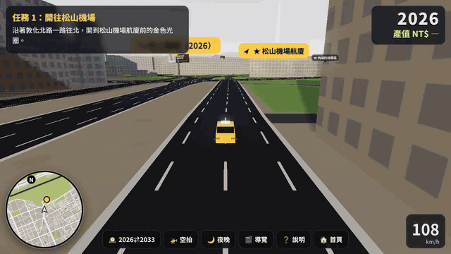
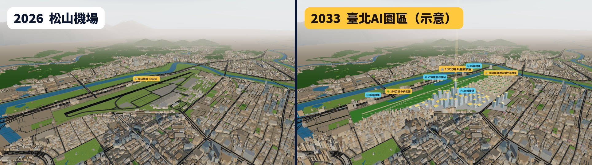
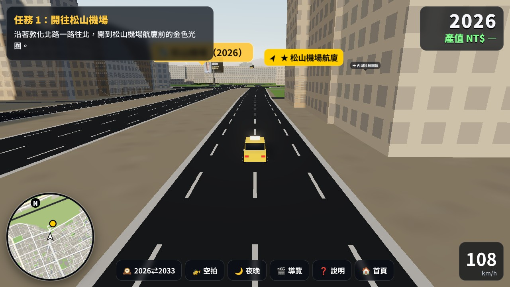
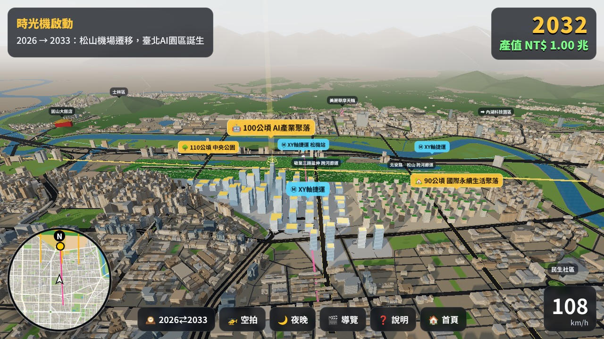
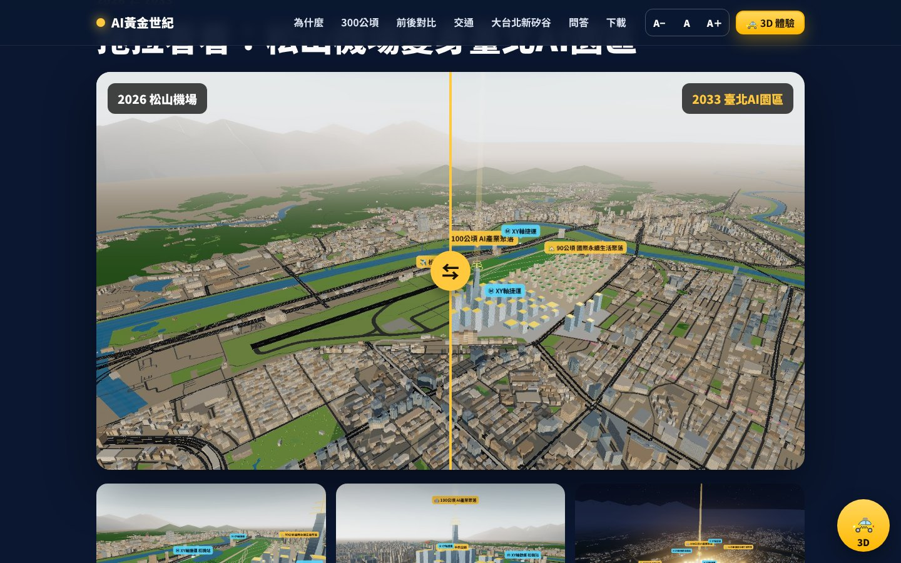
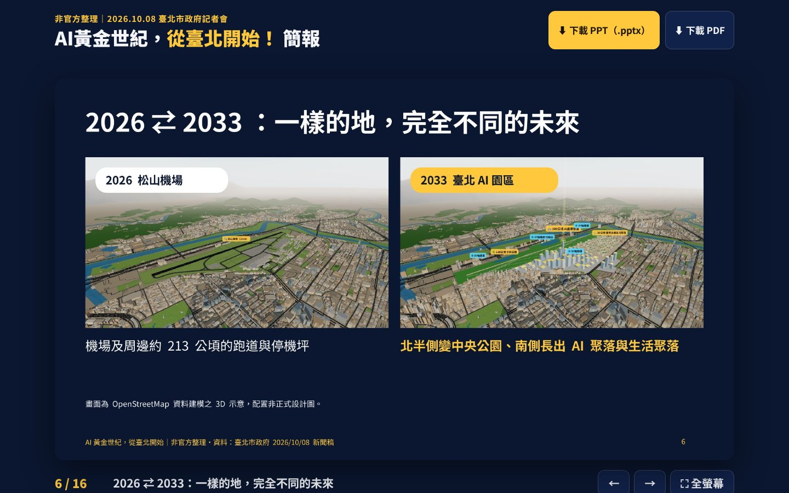

<p align="center">
  <a href="https://ai2033.taipei/"></a>
</p>

<h1 align="center">臺北 2033｜AI黃金世紀，從臺北開始</h1>

<p align="center">
  <a href="https://ai2033.taipei/"><b>👉 ai2033.taipei</b></a><br>
  開著臺北小黃，在 3D 臺北親眼看松山機場變身 300 公頃「臺北AI園區」
</p>

<p align="center">
  <a href="https://ai2033.taipei/"></a>
  <a href="https://ai2033.taipei/3d/"></a>
  <a href="https://www.openstreetmap.org/copyright"></a>
  
</p>

2026/10/08，臺北市長蔣萬安在「打造AI黃金世紀、全面釋放都市潛力」記者會宣布：規劃**遷移松山機場**，整合機場及周邊 **300 公頃**打造「臺北AI園區」，包括 **100 公頃 AI 產業聚落**、**90 公頃國際永續生活聚落**與 **110 公頃中央公園**，並解鎖 **570 公頃**受航高限制的都更地區。

這個網站把那場記者會整理成四種好入口：大字版懶人包、GTA 風格的 3D 臺北、可搜尋的逐字稿，以及可線上翻閱或下載的簡報。

## 🎬 示範影片

<p align="center">
  <a href="docs/demo.mp4"></a>
  <br><sub>點圖看完整影片（<a href="docs/demo.mp4">MP4，約 50 秒</a>）：開小黃上敦化北路 → 時光機啟動 2026 → 2033 → 中央公園、AI 產業聚落、生活聚落 → 入夜的園區</sub>
</p>

## 🔗 一站看懂

| | 內容 | 連結 |
|---|---|---|
| 🌐 | **大字版互動網站**：重點整理、前後對比滑桿、300 公頃怎麼用、XY 軸捷運、大台北新矽谷、問答 | https://ai2033.taipei/ |
| 🚕 | **3D 臺北 2033**：開車到松機，按下時光機看 2026 ⇄ 2033 | https://ai2033.taipei/3d/ |
| 📜 | **記者會逐字稿**：大字、可搜尋、可下載 Markdown | https://ai2033.taipei/transcript/ |
| 📊 | **簡報**：16 頁線上翻閱＋講者備註，PPTX／PDF 下載 | https://ai2033.taipei/slides/ |

## 🖼️ 畫面

**2026 松山機場 ⇄ 2033 臺北AI園區（3D 示意）**



<table>
  <tr>
    <td width="50%"><br><sub>任務 1：沿敦化北路開往松山機場航廈</sub></td>
    <td width="50%"><br><sub>時光機啟動：2026 → 2033</sub></td>
  </tr>
  <tr>
    <td><br><sub>大字版網站（字級可調）</sub></td>
    <td><br><sub>前後對比滑桿</sub></td>
  </tr>
  <tr>
    <td><br><sub>逐字稿：可搜尋、可下載</sub></td>
    <td><br><sub>簡報：線上翻閱＋講者備註</sub></td>
  </tr>
</table>

<p align="center"><br><sub>手機版</sub></p>

## 🚕 3D 體驗怎麼玩

1. **任務 1：開往松山機場**　從敦化北路出發（離航廈約 500 公尺），開進航廈前的金色光圈。
2. **時光機啟動**　鏡頭繞著松機轉一圈，跑道消失，中央公園、AI 產業聚落與生活聚落一棟棟長出來。
3. **任務 2：探索 2033**　依序通過金色光圈：中央公園、AI 產業聚落、生活聚落、XY 軸捷運、跨河廊道、570 公頃都更。
4. **自由探索**　隨時切換 2026 ⇄ 2033、空拍、夜晚、導覽動畫。

| 操作 | 電腦 | 手機 |
|---|---|---|
| 開車 | `W` `A` `S` `D`／方向鍵，`Shift` 加速，`空白` 煞車 | 左下搖桿＋右側油門／煞車 |
| 空拍 | `F` 切換；`W` `A` `S` `D` 移動，`E`／`Q` 升降，拖曳轉視角 | 🚁 按鈕 |
| 其他 | `Y` 年份、`N` 日夜、`T` 導覽、`R` 回到道路、`H` 說明 | 下方工具列 |

## 🧱 怎麼做的

- **真實街廓**：OpenStreetMap 臺灣圖資（Geofabrik），以 `osmium` 擷取臺北範圍，`tools/build/build_city.py` 轉成約 6 萬棟建築、道路、河川、捷運與地標的精簡 JSON（`3d/data/city.json`）。
- **園區配置**：依新聞稿文字，在機場與鄰近營區範圍上切出北側 110 公頃中央公園、南側 100 公頃 AI 產業聚落與 90 公頃生活聚落（**示意**，非正式設計圖）。
- **3D**：three.js r160（`vendor/three/`，無打包工具）；instanced mesh、shader 窗光與日夜、成長動畫、UnrealBloom、陰影、小地圖；手機自動降畫質。
- **網站**：純 HTML／CSS／JS，字級三段可調、深色高對比、行動優先。
- **逐字稿**：`tools/build/build_transcript.py` 由市府新聞稿與媒體答問整理；有音檔時可用 Whisper 重新轉寫（見下方）。
- **簡報**：`tools/build/deck.js`（pptxgenjs）產生 PPTX，LibreOffice 轉 PDF；`tools/build/slides_page.py` 產生線上翻閱頁。
- **素材**：`render.mjs`（3D 靜態圖）、`screenshots.mjs`（README 截圖）、`cards.mjs`（社群預覽圖與片頭片尾）、`record_demo.mjs`＋`make_demo.sh`（以虛擬時鐘逐格錄製示範影片）。

## 🗂️ 專案結構

```
index.html              大字版互動網站
3d/                     3D 臺北 2033（index.html、style.css、js/、data/city.json）
transcript/             逐字稿頁與 transcript.md
slides/                 簡報 PPTX／PDF 與線上翻閱頁（img/、thumb/）
assets/                 網站樣式、照片（含授權資訊）、3D 渲染圖、社群分享圖
docs/                   README 用的示範影片、截圖、社群預覽圖
tools/build/            資料與素材產生腳本
tools/fetch/            在 GitHub Actions 抓取照片、OSM、新聞原文與音訊
tools/verify/           上線後的連結與瀏覽器檢查
.github/workflows/      上述抓取與檢查的工作流程
CNAME, sitemap.xml, robots.txt
```

## 💻 在本機執行

```bash
npx http-server -p 8123 .
# 開啟 http://127.0.0.1:8123/ 與 http://127.0.0.1:8123/3d/
```

本站部署於 GitHub Pages（本分支根目錄），自訂網域 `ai2033.taipei` 由 `CNAME` 設定，推送後約一分鐘生效。

## 🎙️ 影片逐字聽打版（Whisper）

YouTube 擋下雲端主機的自動下載，所以逐字稿頁目前是**市府新聞稿版致詞全文**，加上媒體報導整理的答問重點。以下任一方式提供音訊後，`fetch-transcript` 工作流程會自動用 Whisper 轉寫、轉成繁體，並更新逐字稿頁：

1. 把影片或音檔（mp3／m4a／mp4）上傳到 `research/youtube/input/`
2. 在 Actions → fetch-transcript → Run workflow，填入可直接下載的影音網址
3. 在 repo Secrets 新增 `YT_COOKIES`（YouTube cookies.txt），再手動執行 fetch-transcript

## 📚 資料來源與授權

- 內容依據：[臺北市政府新聞稿（2026/10/08）](https://www.gov.taipei/News_Content.aspx?n=F0DDAF49B89E9413&sms=72544237BBE4C5F6&s=8ED4D25BC664CF21)、[記者會影片](https://youtu.be/ircGbXWHRbQ)，以及中央社、自由時報、TVBS、聯合報等報導
- 地圖：© OpenStreetMap 貢獻者（ODbL），Geofabrik 擷取
- 照片：Wikimedia Commons（作者與授權見 `assets/photos/credits.json` 與網站底部）
- 3D 園區配置、產值與戶數為依新聞稿文字繪製或引用之**示意與市府估算**，非正式設計圖

> 本站為**非官方**粉絲整理，與臺北市政府無隸屬關係；正式內容請以臺北市政府公告為準。
